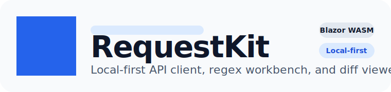

<p align="center">
  
</p>

<p align="center">
  <strong>Local-first API client, regex workbench, and diff viewer built with Blazor WebAssembly.</strong>
</p>

<p align="center">
  
  
  
  
  
  
</p>

RequestKit is a browser-native developer workbench for three jobs that usually end up scattered across different tools:

- sending HTTP requests
- testing regular expressions against real payloads
- diffing text and response snapshots

The project is intentionally local-first. Workspaces live in IndexedDB, the UI runs as a pure Blazor WebAssembly app, and deployment is static-friendly enough to ship on Vercel without a custom backend.

## Why RequestKit

- One workspace for requests, collections, environments, regex experiments, and diffs.
- API responses can flow directly into the regex and diff tools.
- Workspaces autosave locally, so you can treat the app like a scratchpad instead of a fragile form.
- The entire app is browser-based and deploys as static assets.
- cURL import/export makes it practical for day-to-day API debugging.

## Feature Tour

| Tool | What it covers | Notable capabilities |
| --- | --- | --- |
| API Client | Build and run requests inside the browser | Collections and folders, environments, auth modes, raw and form-urlencoded bodies, request cancellation, history restore, cURL import/export, response handoff |
| Regex Builder | Test patterns against live text and response payloads | Live matches, capture groups, flags, token-by-token explanations, common pattern library, highlighted match preview |
| Diff Viewer | Compare payloads, fixtures, and config changes | Side-by-side and unified diff modes, JSON prettify, realistic starter samples, direct response-to-diff workflow |

## Highlights

- Browser-only Blazor WebAssembly app targeting `net10.0`
- Local workspace persistence with IndexedDB
- Shared state across API, regex, and diff workflows
- Response inspector with `Raw`, `Pretty`, and `Preview` modes
- JSON tree rendering and body download support
- Workspace autosave, history retention, and quick tool switching

## Tech Stack

| Layer | Technology |
| --- | --- |
| UI | Blazor WebAssembly, Razor components, CSS |
| App shell | .NET 10, C#, singleton state containers |
| Storage | IndexedDB via JS interop |
| Networking | Browser `fetch` via JS interop |
| Editing | Monaco Editor loaded on demand from CDN |
| Diff engine | DiffPlex |
| Hosting | Static output, Vercel-ready |

## Architecture

RequestKit is split into three focused projects:

```text
src/
  RequestKit.Wasm/    App entrypoint, DI, static host bootstrapping
  RequestKit.Shared/  Razor UI, layouts, components, JS interop
  RequestKit.Core/    State containers, models, services, diff/cURL helpers
```

That split keeps the workbench UI separate from state and domain logic:

- `RequestKit.Wasm` wires up the Blazor runtime and app services.
- `RequestKit.Shared` contains the actual workbench UI and browser interop layer.
- `RequestKit.Core` holds models, state, URL syncing, cURL parsing/export, regex explanation, and diff computation.

## Getting Started

### Prerequisites

- .NET 10 SDK

### Run locally

```bash
dotnet restore
dotnet run --project src/RequestKit.Wasm --launch-profile http
```

Then open:

```text
http://localhost:5107
```

### Build the solution

```bash
dotnet build RequestKit.slnx
```

### Publish static assets

```bash
dotnet publish src/RequestKit.Wasm/RequestKit.Wasm.csproj -c Release -o output --nologo
```

The static site will be emitted to `output/wwwroot`.

## Deploying to Vercel

The repository already includes a `vercel.json` configured for static deployment:

- build command publishes the Blazor WebAssembly app
- output directory is `output/wwwroot`
- rewrites send all routes to `index.html`
- cache and security headers are preconfigured for framework assets

Typical deploy flow:

```bash
vercel
```

## Browser Networking Model

RequestKit sends HTTP requests from the browser using `fetch`.

That means:

- direct requests are subject to normal browser CORS rules
- cookies and browser security policies behave like any other front-end app
- the API client can optionally prepend an external proxy URL when direct access is blocked

If you are testing public APIs or services that already allow browser access, the default direct mode is the simplest path. If not, configure an external proxy in workspace settings.

## Workspace Model

- Workspaces are stored locally in IndexedDB.
- Collections support nested folders and reusable request definitions.
- Environments can hold variables for URL, header, auth, and body interpolation.
- History snapshots can be reopened directly or restored as new requests.
- Autosave, timeout, redirect behavior, and max history size are workspace settings.

## Keyboard Shortcuts

| Shortcut | Action |
| --- | --- |
| `Ctrl+1` | Switch to API Client |
| `Ctrl+2` | Switch to Regex Builder |
| `Ctrl+3` | Switch to Diff Viewer |

## Project Notes

- RequestKit is local-first by design. There is no mandatory backend.
- The app is intentionally deployable as a static site.
- Monaco is loaded from CDN at runtime, so editor availability depends on network access.
- The browser-only model is a feature, but it also means RequestKit will never behave exactly like a server-side API proxy.

## Roadmap Direction

- richer request testing and assertions
- multipart form-data and file upload support
- OpenAPI import
- deeper collection management flows
- broader response visualization and debugging tools

## Repository Layout

```text
.
├── README.md
├── RequestKit.slnx
├── vercel.json
└── src
    ├── RequestKit.Core
    ├── RequestKit.Shared
    └── RequestKit.Wasm
```

## Contributing

If you want to improve the workbench, focus changes on one of these layers:

- `RequestKit.Core` for models, state, parsing, or transformation logic
- `RequestKit.Shared` for UI, interaction design, or browser interop
- `RequestKit.Wasm` for host startup and deployment-facing concerns

Before opening changes, run:

```bash
dotnet build RequestKit.slnx
```
